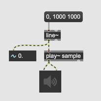
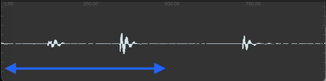
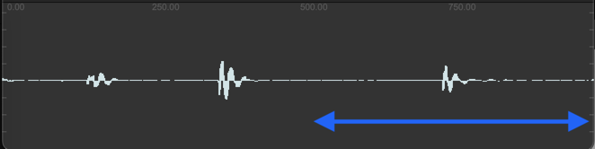
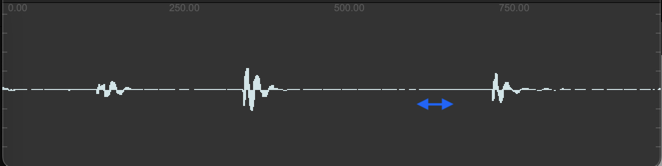

# Granular Sampling (1)

### From Loop Playback to Sound Grain

### Assignment 1:
Record 1 second of your voice using [record~] and [buffer~].
Then, play it back using [play~].

### Assignment 2:
In addition to Assignment 1, play back the entire buffer repeatedly in an endless loop.

Hint: Use the right outlet of [play~].

### [play~] can be controlled by an audio signal

### Assignment 3:
Implement Assignment 2 again using [phasor~] as the driver for playback.

Hint: 
- [phasor~] outputs values between 0 and 1.
- [play~] interprets the incoming signal to its left inlet as the playback position in milliseconds.

### Assignment 4:
Modify the patch from Assignment 3 to play the entire buffer twice as fast as the original in a loop.

### Assignment 5:
Modify the patch from Assignment 3 to play only the first half of the [buffer~] at the original speed.

### Assignment 6:
Modify the patch from Assignment 5 to play only the second half of the [buffer~] at the original speed.

### Assignment 7:
Modify the patch from Assignment 6 to play only 50 milliseconds of the [buffer~] at the original speed, starting from the 600-millisecond point in the [buffer~].

### Assignment 8:
Based on Assignment 7, add a [slider] to the patch to enable the user to control the start position of playback.

### Assignment 9:
Review the patch from Assignment 8 and discuss the problems and potential solutions.