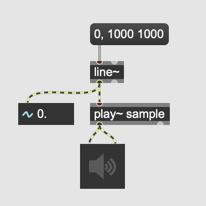

# Granular Sampling (1)

### from loop playback to sound grain

### Assignment 1:
Record 1 second of your voice with [record~] and [buffer~].
Then, play it back with [play~].

### Assignment 2:
In addition to assignment 1, playback the entire buffer repeatedly endlessly.

Hint: right outlet of [play~]

### play~ can be controlled by audio signal

### Assignment 3:
Implement Assignment 2, using [phasor~] as the driver of playback

Hint: 
- [phasor~] outputs the value between 0 and 1.  
- [play~] interprets incoming signal to its left inlet as playback position in ms.

### Assignment 4:
Modify the patch for Assignment 3 and play the entire buffer twice as first as original in loop.

### Assignment 5:
Modify the patch for Assignment 3 and play only the first half of the [buffer~] in the original speed.

### Assignment 6:
Modify the patch for Assignment 5 and play only the second half of the [buffer~] in the original speed.

### Assignment 7:
Modify the patch for Assignment 6 and play only the 50 msec of the [buffer~] with the original speed from 600 msec point in the [buffer~]

### Assignment 8:
Based on Assignment 7.
Add a [slider] to the patch and enable the user to control the start position of playback.

### Assignment 9:
Review the patch of Assignment 8 and discuss the problems and potential solutions.

