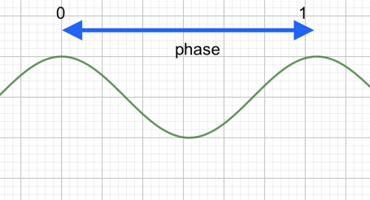
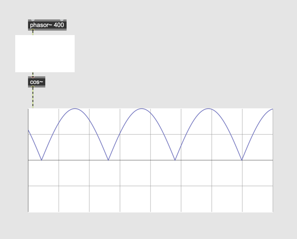

# Granular Sampling (2)

### Click noise
Click noise is a short, transient sound artifact caused by sudden signal discontinuities, such as digital errors, sample dropouts, or **abrupt waveform changes** in audio processing.

### Windowing

In granular sampling, a windowing function shapes individual grains by smoothly fading them in and out. This prevents abrupt amplitude changes, reducing artifacts like clicks . Different window shapes (e.g.,Sine, Hann, Gaussian) affect the grain’s timbre and smoothness.

### [cos~]
this object outputs a cosine curve, based on the incoming signal.

### Assignment 1:
generate a sine window using [phasor~ 400] and [cos~]

### Assignment 2:
Load K1 Assignment 8 patch. 
Remove click noise by syncing [phasor~] and [cos~].

### Assignment 3:
The click noise is now removed from the grain playback but still the click noise can be heard when we change the playback position with the slider. Explain why.

### [sah~]
sample and hold object captures one audio sample in the incoming signal to the left inlet when the control signal exceeds the threshold value given as an argument and keep output that captured sample until the control signal exceeds the threshold next time.

### Assignment 4:
Using the [sah~] object in the patch avoid the click noise when the playback position is changed by the slider.

### Assignment 5:
Based on the patch for assignment 4. Add one more slider to the patch and change the pitch of grains by the slider.

### Assignment 6:
Apply the technique used for Assigment 4 and avoid click noise, when changing the pitch of the grain

### Assignment 7:
Add a keyboard to the patch and enables the user to transpose the grain pitch by pressing the key, using A4 as the original pitch.

e.g. if the user press C5 key, the pitch should be shifted by a minor third.

### Assignment 8:
Duplicate the granular engine twice and play a chord (e.g. a major 3rd) with it.
