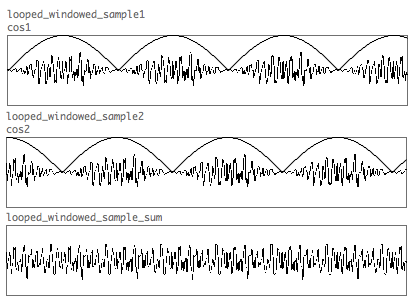
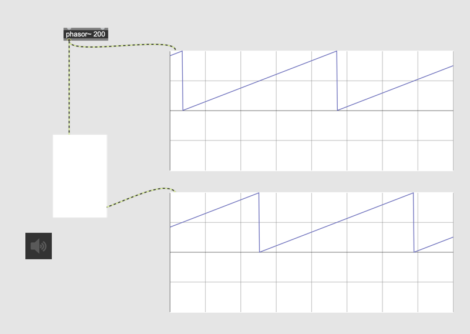

# Granular Sampling (3)

Currently, granular sampling sounds like "tremolo". We can further smoothen the texture of granular sound using OLA.

### OLA (Overlap and Add)
Overlap and Add (OLA) is a technique used in signal processing to reconstruct a modified signal by overlapping and summing windowed segments. It ensures smooth transitions between segments, reducing artifacts in applications like time-stretching, pitch-shifting, and granular sampling.

### Assignment 1:
create a [phasor~ 200] and shift the phase of the  generated signal by [phasor~ 200] by 180 degrees. 

Hint: [trunc~]

### Assignment 2:
Download [K3 Assignment 6](K2/a6.maxpat) and make the granular sound smoother, duplicating the granular engine and apply the technique introduced in assignment 1.

### Assignment 3:
The patch for assignment2 looks very complex.
Use abstraction for grain playback part and simplify the patch.

### Assignment 4:
create quadrable OLA in which each phaser shifted by 90 degrees and apply it to the granular patch. compare the sound with the double OLA.is it better?

